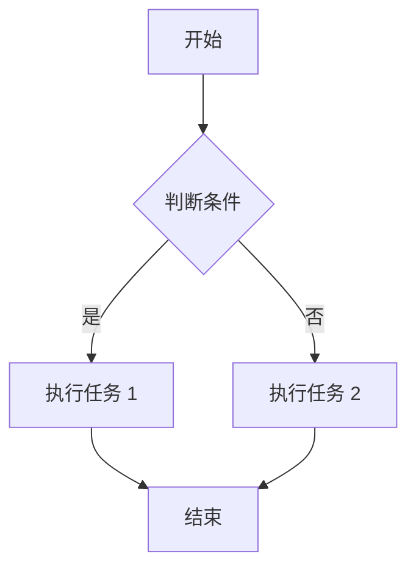
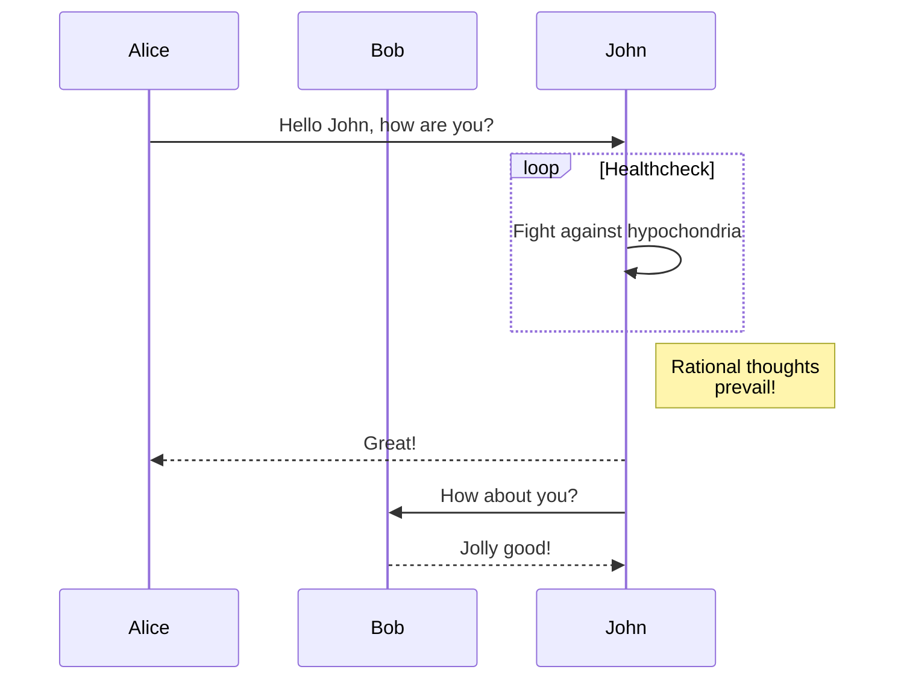

# Mermaid 测试

这是一个用于测试 Mermaid 图表渲染的文档。

## 流程图测试

```mermaid
graph TD;
    A[开始]-->B{判断条件};
    B-- 是 -->C[执行任务 1];
    B-- 否 -->D[执行任务 2];
    C-->E[结束];
    D-->E;
```

## 时序图测试

```mermaid
sequenceDiagram
    participant Alice
    participant Bob
    Alice->>John: Hello John, how are you?
    loop Healthcheck
        John->>John: Fight against hypochondria
    end
    Note right of John: Rational thoughts <br/>prevail!
    John-->>Alice: Great!
    John->>Bob: How about you?
    Bob-->>John: Jolly good!
```
